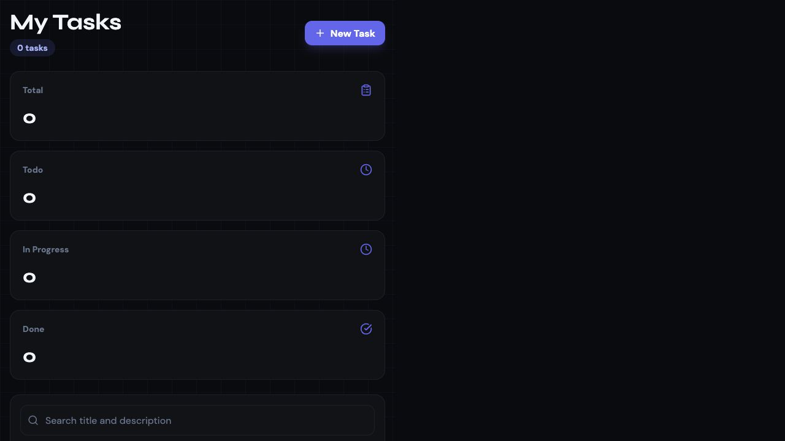
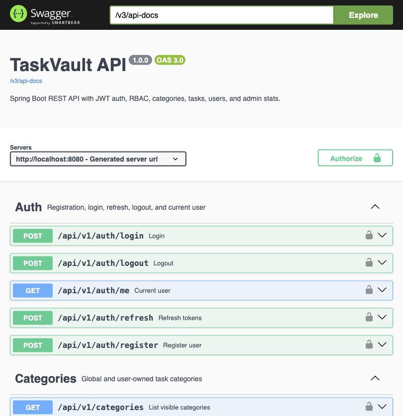
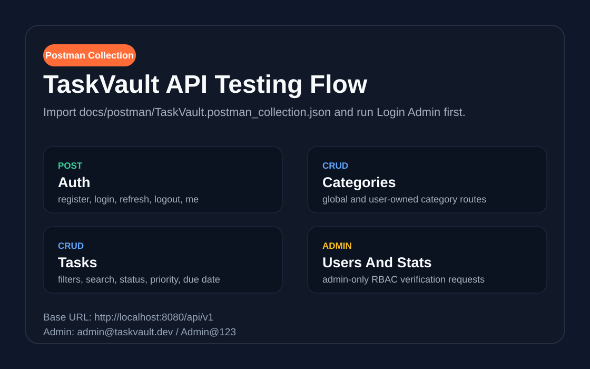

# TaskVault - Spring Boot REST API + React Frontend

## Admin Credentials And Links

| Item | Value |
| --- | --- |
| Admin email | `admin@taskvault.dev` |
| Admin password | `Admin@123` |
| Admin role | `ADMIN` |
| Frontend | `http://localhost:5173` |
| Backend API | `http://localhost:8080/api/v1` |
| Swagger UI | `http://localhost:8080/swagger-ui.html` |
| OpenAPI JSON | `http://localhost:8080/v3/api-docs` |
| Health check | `http://localhost:8080/api/health` |
| Postman collection | [`docs/postman/TaskVault.postman_collection.json`](docs/postman/TaskVault.postman_collection.json) |

TaskVault is a complete backend-focused intern assignment project for Primetrade.ai. It includes a Java 17 Spring Boot 3.2 REST API, PostgreSQL schema, JWT authentication with refresh token rotation, role-based authorization, category and task CRUD, Swagger/OpenAPI documentation, Docker Compose, and a React 18 frontend for real API testing.

## Submission Deliverables

| Requirement | Status | Where to verify |
| --- | --- | --- |
| Backend project hosted in GitHub with README setup | Ready | This folder contains the full backend, frontend, Docker, API docs, and run commands. Push this repository to GitHub after final review. |
| Working APIs for authentication and CRUD | Implemented | `backend/src/main/java/com/taskvault/controller` |
| Basic frontend UI that connects to APIs | Implemented | `frontend/src/pages` and `frontend/src/api` |
| API documentation | Implemented | Swagger UI and Postman collection |
| Scalability note | Implemented | [`SCALABILITY.md`](SCALABILITY.md) |

## Tech Stack

| Area | Stack |
| --- | --- |
| Backend | Java 17, Spring Boot 3.2.5, Spring Security 6, Spring Data JPA, Bean Validation |
| Auth | BCrypt password hashing, JWT access tokens, refresh token rotation |
| Database | PostgreSQL 15, Hibernate, UUID primary keys |
| Docs | SpringDoc OpenAPI at `/swagger-ui.html`, Postman collection |
| Frontend | React 18, Vite, Tailwind CSS, axios interceptors, React Router, react-hot-toast |
| Deployment | Dockerfiles and Docker Compose |

## Run Everything In One Place

Docker Compose is the easiest way to run the entire project together.

```bash
cd taskvault
docker compose up --build
```

If local PostgreSQL is already using port `5432`, run the stack with a different host port for the Docker database:

```bash
cd taskvault
POSTGRES_PORT=5433 docker compose up --build
```

Open these URLs after the containers start:

```text
Frontend: http://localhost:5173
Swagger:  http://localhost:8080/swagger-ui.html
Health:   http://localhost:8080/api/health
```

Stop the stack:

```bash
docker compose down
```

Reset the database volume:

```bash
docker compose down -v
```

## Run Backend Manually

Start PostgreSQL locally with database `taskvault`, username `postgres`, and password `postgres`. Then run:

```bash
cd taskvault/backend
mvn spring-boot:run
```

Useful local environment variables:

```text
DB_HOST=localhost
DB_PORT=5432
DB_NAME=taskvault
DB_USER=postgres
DB_PASSWORD=postgres
JWT_ACCESS_SECRET=replace-with-a-minimum-32-character-access-secret
JWT_REFRESH_SECRET=replace-with-a-minimum-32-character-refresh-secret
FRONTEND_URL=http://localhost:5173
ADMIN_EMAIL=admin@taskvault.dev
ADMIN_PASSWORD=Admin@123
```

## Run Frontend Manually

```bash
cd taskvault/frontend
npm install
cp .env.example .env
npm run dev
```

The frontend reads:

```text
VITE_API_URL=http://localhost:8080/api/v1
```

## Build Commands

Backend tests:

```bash
cd taskvault/backend
mvn test
```

Frontend production build:

```bash
cd taskvault/frontend
npm install
npm run build
```

Validate Docker Compose:

```bash
cd taskvault
docker compose config
```

## Docker Image Commands

Build local images:

```bash
cd taskvault
docker compose build
```

Build a backend image directly:

```bash
cd taskvault/backend
docker build -t taskvault-backend:latest .
```

Build a frontend image directly:

```bash
cd taskvault/frontend
docker build -t taskvault-frontend:latest .
```

Push images to Docker Hub after logging in:

```bash
docker login
docker tag taskvault-backend:latest <dockerhub-username>/taskvault-backend:latest
docker tag taskvault-frontend:latest <dockerhub-username>/taskvault-frontend:latest
docker push <dockerhub-username>/taskvault-backend:latest
docker push <dockerhub-username>/taskvault-frontend:latest
```

## Free Hosting Options

| Layer | Free option | Notes |
| --- | --- | --- |
| Frontend | Vercel or Netlify | Build from `frontend/`, set `VITE_API_URL` to hosted backend URL. |
| Backend | Render or Railway | Deploy `backend/` as a Java web service with Java 17 and `mvn spring-boot:run`. |
| Database | Neon or Supabase Postgres | Copy the hosted connection values into backend environment variables. |
| One-place deployment | Render Blueprint or Railway | Use Docker services if you want backend and database managed from one dashboard. |

For an intern assignment, the simplest free split is Vercel for frontend, Render for backend, and Neon for PostgreSQL.

## API Documentation

Swagger UI is generated automatically from SpringDoc:

```text
http://localhost:8080/swagger-ui.html
```

Import the Postman collection from:

```text
docs/postman/TaskVault.postman_collection.json
```

## Screenshots And Testing Evidence

Live React dashboard after admin login:



Swagger API documentation:



Postman collection preview:



Recommended Postman flow:

1. Run `POST Auth - Login Admin`.
2. The collection stores `access_token` and `refresh_token`.
3. Run category and task CRUD requests.
4. Run admin-only requests with the admin account.

## API Endpoint Summary

| Method | Route | Auth | Description |
| --- | --- | --- | --- |
| `POST` | `/api/v1/auth/register` | Public | Register a user |
| `POST` | `/api/v1/auth/login` | Public | Login and receive access/refresh tokens |
| `POST` | `/api/v1/auth/refresh` | Public | Rotate refresh token |
| `POST` | `/api/v1/auth/logout` | Public | Delete refresh token |
| `GET` | `/api/v1/auth/me` | Bearer token | Current user |
| `GET` | `/api/v1/categories` | Bearer token | Global and owned categories |
| `POST` | `/api/v1/categories` | Bearer token | Create category |
| `GET` | `/api/v1/categories/{id}` | Bearer token | Read category |
| `PUT` | `/api/v1/categories/{id}` | Bearer token | Update category |
| `DELETE` | `/api/v1/categories/{id}` | Bearer token | Delete category |
| `GET` | `/api/v1/categories/admin/all` | Admin | All categories |
| `GET` | `/api/v1/tasks` | Bearer token | List, filter, search, and sort tasks |
| `POST` | `/api/v1/tasks` | Bearer token | Create task |
| `GET` | `/api/v1/tasks/{id}` | Owner or admin | Read task |
| `PUT` | `/api/v1/tasks/{id}` | Owner or admin | Full update task |
| `PATCH` | `/api/v1/tasks/{id}` | Owner or admin | Partial update task |
| `DELETE` | `/api/v1/tasks/{id}` | Owner or admin | Delete task |
| `GET` | `/api/v1/tasks/stats` | Admin | Task analytics |
| `GET` | `/api/v1/users` | Admin | Paginated users |
| `GET` | `/api/v1/users/{id}` | Admin | Single user |
| `PATCH` | `/api/v1/users/{id}/role` | Admin | Change role |
| `PATCH` | `/api/v1/users/{id}/status` | Admin | Activate/deactivate user |
| `DELETE` | `/api/v1/users/{id}` | Admin | Soft delete user |
| `GET` | `/api/health` | Public | Health check |

## Example API Test

Login:

```bash
curl -X POST http://localhost:8080/api/v1/auth/login \
  -H "Content-Type: application/json" \
  -d '{"email":"admin@taskvault.dev","password":"Admin@123"}'
```

Create a task after replacing `<ACCESS_TOKEN>`:

```bash
curl -X POST http://localhost:8080/api/v1/tasks \
  -H "Authorization: Bearer <ACCESS_TOKEN>" \
  -H "Content-Type: application/json" \
  -d '{"title":"Submit backend assignment","description":"Final verification through Swagger, Postman, and React UI","status":"TODO","priority":"HIGH","due_date":"2026-06-20"}'
```

## Database Schema

| Table | Purpose |
| --- | --- |
| `users` | Account profile, BCrypt password, role, active flag, timestamps |
| `categories` | User-owned or global category metadata with color and lucide icon name |
| `tasks` | Task records with status, priority, due date, owner, and optional category |
| `refresh_tokens` | Database-backed refresh token rotation and expiry |

Key indexes:

```text
idx_tasks_user_id
idx_tasks_status
idx_tasks_category_id
idx_categories_created_by
idx_refresh_tokens_token
```

## Security Notes

- Passwords are hashed with BCrypt.
- Access tokens expire in 15 minutes.
- Refresh tokens expire in 7 days and rotate on refresh.
- User endpoints require `ADMIN`.
- Task access is owner-or-admin.
- Category access is global, owner, or admin.
- Request DTOs use Jakarta Bean Validation.
- Global exception handling returns consistent JSON responses.
- CORS is restricted through `FRONTEND_URL`.

## Project Structure

```text
taskvault/
├── backend/
│   ├── src/main/java/com/taskvault/
│   │   ├── config/
│   │   ├── controller/
│   │   ├── dto/
│   │   ├── entity/
│   │   ├── enums/
│   │   ├── exception/
│   │   ├── repository/
│   │   ├── security/
│   │   └── service/
│   ├── src/main/resources/
│   ├── src/test/java/com/taskvault/
│   ├── Dockerfile
│   └── pom.xml
├── frontend/
│   ├── src/api/
│   ├── src/components/
│   ├── src/context/
│   ├── src/hooks/
│   ├── src/pages/
│   ├── Dockerfile
│   └── package.json
├── docs/postman/
├── docker-compose.yml
├── README.md
└── SCALABILITY.md
```

## GitHub Submission

After final local verification, push the project to GitHub:

```bash
git add taskvault
git commit -m "Build TaskVault Spring Boot assignment"
git push origin main
```

Then submit the GitHub repository link in the Google Form.
